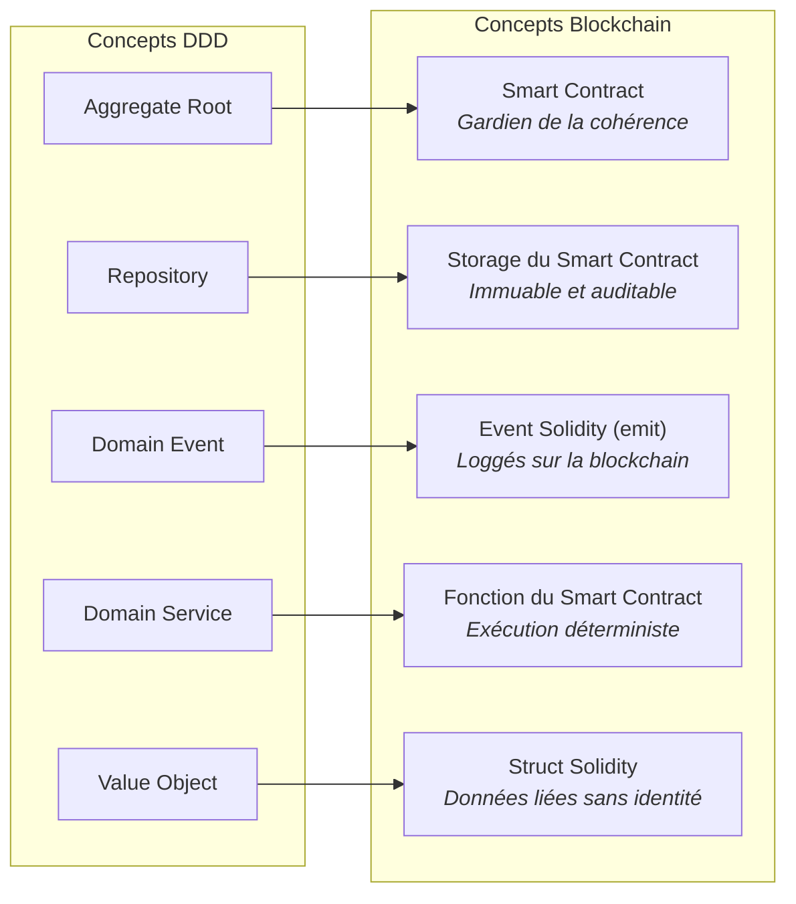

# Blockchain - Application DDD

Application des principes DDD à l'architecture blockchain et aux smart contracts.

## Service-Bus sur Blockchain

Il est possible de créer un service-bus décentralisé en utilisant une blockchain. Chaque service est représenté par un nœud qui communique via des smart contracts.

```pseudo
// Principe du Service-Bus décentralisé sur Blockchain
// Au lieu d'un bus de messages centralisé (RabbitMQ, Kafka...),
// on utilise la blockchain comme intermédiaire immuable et transparent.

SERVICE_BUS Blockchain:

    // Publication d'un message (= transaction blockchain)
    Service_A.publier("CommandeCréée", données):
        smart_contract.enregistrer_événement("CommandeCréée", données)
        // La transaction est minée et devient immuable

    // Souscription (= écoute des événements du smart contract)
    Service_B.souscrire("CommandeCréée"):
        QUAND smart_contract ÉMET "CommandeCréée":
            traiter(données)

    // Avantage : aucun service central ne peut tomber en panne
    // Inconvénient : chaque message coûte du "gas" (frais de transaction)
```

### Avantages

- **Sécurité** : Transactions cryptographiquement sécurisées
- **Transparence** : Historique immuable des messages
- **Résilience** : Pas de point de défaillance unique
- **Traçabilité** : Audit complet des échanges

### Défis

- Performance des transactions
- Coût de traitement (gas)
- Complexité des smart contracts

## Exemple Solidity

Smart contract de messagerie décentralisée :

```solidity
pragma solidity ^0.8.0;

contract MessageService {
    struct Message {
        string content;
        address sender;
        address receiver;
        uint256 timestamp;
    }

    Message[] public messages;

    event MessageSent(address indexed sender, address indexed receiver, uint256 timestamp);

    function sendMessage(string memory _content, address _receiver) public {
        require(_receiver != msg.sender, "Cannot send to self");
        messages.push(Message(_content, msg.sender, _receiver, block.timestamp));
        emit MessageSent(msg.sender, _receiver, block.timestamp);
    }

    function getMessagesReceived() public view returns (Message[] memory) {
        uint256 count = 0;
        for (uint256 i = 0; i < messages.length; i++) {
            if (messages[i].receiver == msg.sender) {
                count++;
            }
        }

        Message[] memory received = new Message[](count);
        uint256 index = 0;
        for (uint256 i = 0; i < messages.length; i++) {
            if (messages[i].receiver == msg.sender) {
                received[index] = messages[i];
                index++;
            }
        }
        return received;
    }
}
```

## Domain Events Blockchain

Les événements Solidity (`emit`) correspondent naturellement aux Domain Events :

| Domain Event | Solidity Event |
|--------------|----------------|
| MessageSent | `emit MessageSent(sender, receiver)` |
| TransferCompleted | `emit Transfer(from, to, amount)` |
| ContractCreated | `emit Created(owner, timestamp)` |

## Intégration avec DDD

Le smart contract agit comme :
- **Aggregate Root** : Gère la cohérence des données
- **Repository** : Stocke l'état sur la blockchain
- **Domain Service** : Exécute la logique métier


